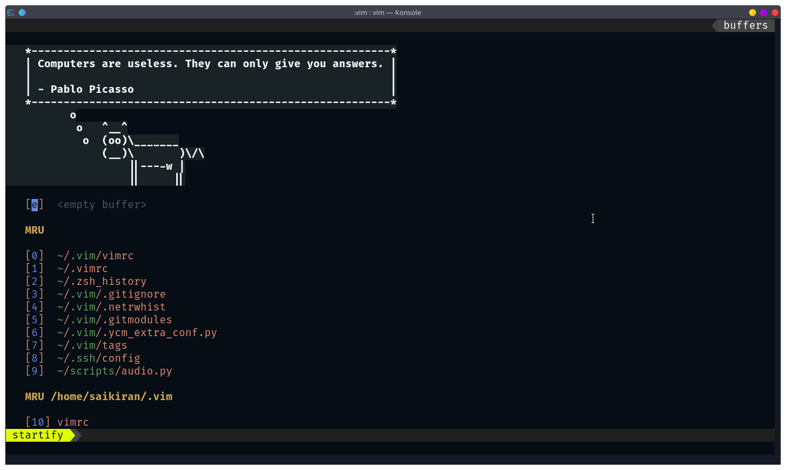
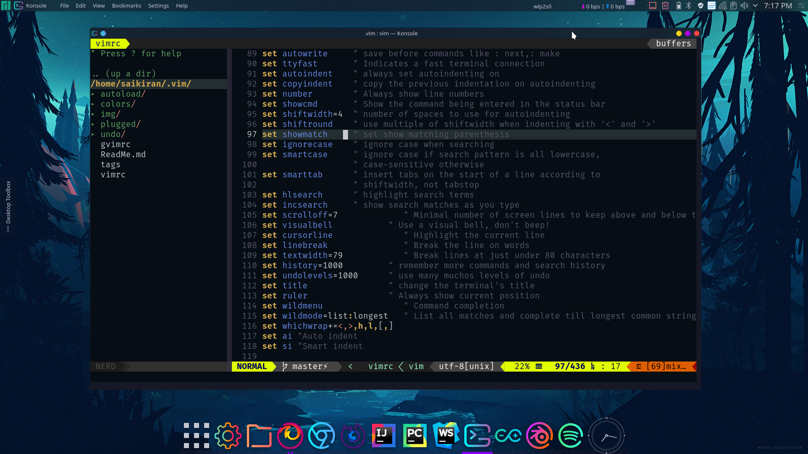
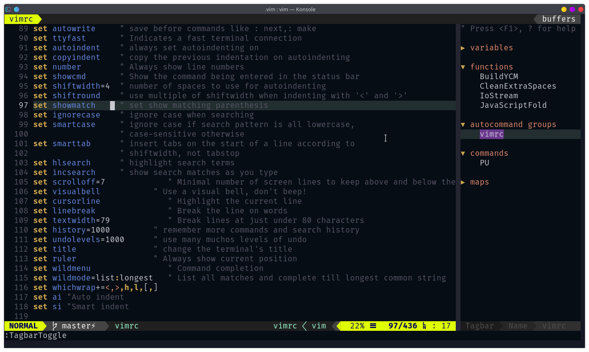
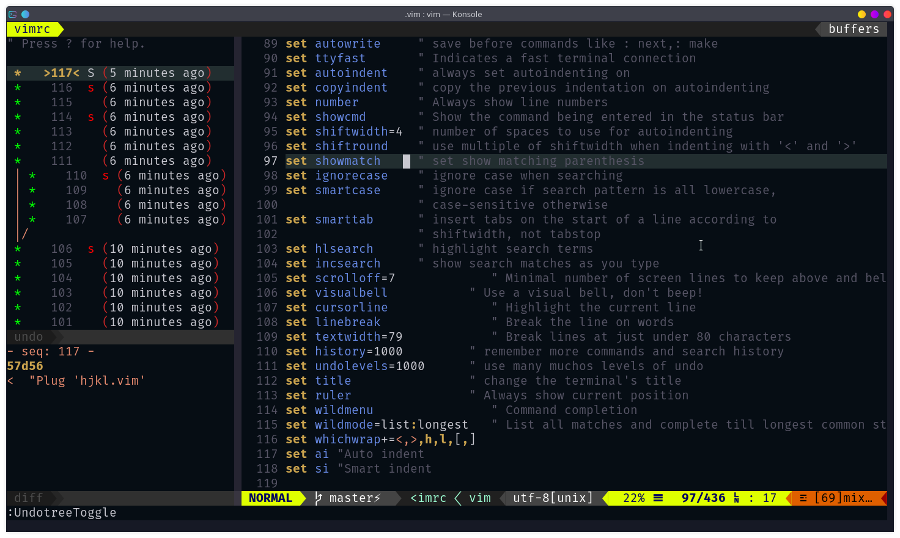

# :pancakes: DotVim

My Vim Configuration Files with plugins. Used latest in Manjaro Linux. I usually use it to write some Python, C/C++, java and React etc. It uses Vim-Plug to manage Plugins.

## Vim Version

VIM - Vi IMproved 8.2 (2019 Dec 12, compiled Jan 26 2020 11:45:38)

Included patches: 1-148

Compiled by Arch Linux(Manjaro OS)

## Screenshot

#### On StartUp



#### NerdTree Plugin



#### Tagbar Plugin



#### UndoTree Plugin



### Short Keys

- nerdtree toggle: `,d`
- rainbowparentheses toggle: `,r`
- vimshell toggle: `,m`
- tagbar toggle: `,t`
- undotree toggle: `,U`
  <!--- prettier trigger: `,p`-->
- spell checking toggle: `,ss`
- paste toggle: `<F2>`
- toggle uppercase/lowercase: `~`
- switch window: `<C-UpDownLeftRight>`
- resize window: `<A-UpDownLeftRightEnter>`
- continue indent text to left or right on select/normal mode: `>` `<`
- Split: `:sp` Vertical Split: `vs`

##### NerdCommenter

- comment/uncomment: `,cc`/`,cu`
- comment toggle: `,c<space>`
- comment sexy : `cs`

##### Vim-Surround

- wrap `{` \ `}` for a word: `ysiw{`
- delete wrap `{` around word: `ds{`
- wrap entire line `{` : `yss{` for parentesis `(`: `yssb`
- change wrap `{` with `[` : `cs{[`
- Surround in Visual Mode : `S<p class="important">`

##### Utilsnips

- expand trigger: `Tab`
- jump forward trigger: `<C-b>`
- jump backward trigger: `<C-z>`

##### Vim-multiple-cursors

- start multicursor: `<C-n>`
- next multicursor : `<C-n>`
- skip multicursor : `<C-x>`
- previous multicursor removing current : `<C-p>`
- stop multicursor: `v`
- select all multicursors: `<A-n>`
- Cancel multicursor: `Esc`

##### Python(Insert Mode)

- `$r` : return
- `$i` : import
- `$p` : print
- `,1` : /class `,C` : ?class
- `,2` : /def `,D` : ?def

##### JavaScript(Import Mode)

- `$r` : return

##### Fugitive

- git status: `:G`
- git \<command\>: `:G<command>`
- git \<operation\>: `:Git <operation>`
- webpage repository: `Gbrowse`

## Upgrading

### For Upgrading all Plugins

Manually you can do

```
  cd ~/.vim
  git submodule foreach git pull origin master
```

or use Vim-Plug updating and upgrading in vim using `:PU` command

## Removing

### For Removing a Plugin

After removing line in plug line in vimrc file do `:PlugClean` to remove plugin directory from plugged directory.

```
  cd ~/.vim
  rm -rf plugged/submodule
  git submodule deinit -f -- plugged/submodule
  rm -rf .git/modules/plugged/submodule
```

Then

```
 git rm -f plugged/submodule
```

Note: plugged/submodule (no trailing slash)
or, if you want to leave it in your working tree and have deleted the plugin

```
  git rm --cached plugged/submodule
```

### Plugins

**use vim-plug manage plugins**： the `.vimrc` will automatic download the vim-plug

- [nerdtree](https://github.com/scrooloose/nerdtree) A tree explorer plugin for vim.
- [nerdcommenter](https://github.com/scrooloose/nerdcommenter) Vim plugin for intensely orgasmic commenting.
- [vim-airline](https://github.com/vim-airline/vim-airline) lean & mean status/tabline for vim that's light as air.
- [vim-airline-themes](https://github.com/vim-airline/vim-airline-themes) A collection of themes for vim-airline.
- [vim-surround](https://github.com/tpope/vim-surround) quoting/parenthesizing made simple.
- [vim-startify](https://github.com/mhinz/vim-startify) A fancy start screen for Vim.
- [vim-signify](https://github.com/mhinz/vim-signify) Show a diff using Vim its sign column.
- [vim-fugitive](https://github.com/tpope/vim-fugitive) A Git wrapper so awesome, it should be illegal.
- [sweet-dark.vim](https://github.com/jschmold/sweet-dark.vim) color scheme as Sweet as kde theme.
- [auto-pairs](https://github.com/jiangmiao/auto-pairs) Insert or delete brackets, parens, quotes in pair.
- [rainbow_parentheses.vim](https://github.com/kien/rainbow_parentheses.vim) Better Rainbow Parentheses.
- [vim-multiple-cursors](https://github.com/terryma/vim-multiple-cursors) Multiple cursors project for vim/neovim.
- [YouCompleteMe](https://github.com/ycm-core/YouCompleteMe) A code-completion engine for Vim.
- [vim-snippets](https://github.com/honza/vim-snippets) vim-snipmate default snippets.
- [UltiSnips](https://github.com/SirVer/ultisnips) The ultimate snippet solution for Vim.
- [vim-easytags](https://github.com/xolox/vim-easytags) A plugin to manage your tag files.
- [ale](https://github.com/dense-analysis/ale.git) Asynchronous Syntax checking hacks for vim.
- [conky-syntax.vim](https://github.com/smancill/conky-syntax.vim) Vim syntax highlighting for conkyrc files.
- [vim-latex-live-preview](https://github.com/xuhdev/vim-latex-live-preview) A Vim Plugin for Lively Previewing LaTeX PDF.
- [tagbar](https://github.com/majutsushi/tagbar) Vim plugin that displays tags in a window, ordered by scope.
- [vim-easytags](https://github.com/xolox/vim-easytags) Automated tag file generation and syntax highlighting of tags in Vim.
- [vim-misc](https://github.com/xolox/vim-misc) Miscellaneous auto-load Vim scripts.
- [vimproc.vim](https://github.com/Shougo/vimproc.vim) Interactive command execution in Vim.
- [vimshell.vim](https://github.com/Shougo/vimshell.vim) :shell: Powerful shell implemented by vim.
- [fzf](https://github.com/junegunn/fzf) :cherry_blossom: A command-line fuzzy finder .
- [fzf.vim](https://github.com/junegunn/fzf.vim) fzf :heart: vim.
- [vim-cpp-enhanced-highlight](https://github.com/octol/vim-cpp-enhanced-highlight) Additional Vim syntax highlighting for C++
  <!--- [vim-prettier](https://github.com/prettier/vim-prettier)  A Vim plugin for Prettier.-->
- [undotree](https://github.com/mbbill/undotree) The undo history visualizer for VIM.
